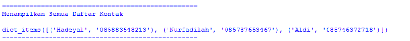

# Labs05
# Latihan 1
## Membuat Dictionary Daftar Kontak
    Dengan keterangan Nama sebagai key, dan nomor sebagai value. Seperti contoh dibawah ini :
```python
daftarkontak = {"Nama":"Nomor Telepon"}
kontak = {"Hadeyal":"085883648213"}, "Nurfadilah":"085787653467"
```
- Data diatas untuk menampung data dari kamus
Berikut contohnya :

### Kondisi 1
```python
print("="*50)
print("   Nama              |    Nomor Telepon   " )
print("="*50)
print(" # Hadeyal        |   ", kontak["Hadeyal"])
print(" # Nurfadilah    |   ", kontak["Nurfadilah"])
print("-"*50)
print()
print()
print("="*50)
```
- Kode untuk mengakses atau menampilkan kontak yang telah ditampung dalam kamus
Berikut hasil dari programnya :

### kondisi 2
```python
print("Menampilkan Kontak Hadeyal")
print("="*50)
print(" # Hadeyal        |   ", kontak["Hadeyal"])
print("-"*50)
print()
print()
print("="*50)
```
- Kode diatas adalah untuk menampilkan salah satu daftar kontak yang ada
Berikut hasil programnya :

### Kondisi 3
```python
print("Menambahkan kontak dengan Nama Aldi")
print("dengan Nomor telepon 085746372718")
kontak["Aldi"]="085746372718"
print("="*50)
print(" # Aldi          |   ", kontak["Aldi"])
print("-"*50)
print()
print()
print("="*50)
```
- kode diatas untuk menambahkan kontak 
Berikut hasil programnya :

### kondisi 4
```python
print("Mengubah Nomor Nurfadilah dengan Nomor 085787653467")
print("="*50)
print(" # Nurfadilah  |    ", kontak["Nurfadilah"])
print("-"*50)
print()
print()
print("="*50)
```
- Kode diatas untuk mengubah kontak
Berikut hasil programnya :

### Kondisi 5
```python
# Menampilkan semua Nama
print("Menampilkan Semua Nama dalam Kontak")
print("="*50)
print(kontak.keys())
print("-"*50)
print()
print()
print("="*50)
```
- kode diatas untuk menampilkan semua nama dalam daftar kontak
Berikut hasil programnya :

### Kondisi 6
```python
print("Menampilkan semua Nomor dalam Konntak")
print("="*50)
print(kontak.values())
print("-"*50)
print()
print()
print("="*50)
```
- kode diatas adalah untuk menampilkan semua nomor yang ada
Berikut hasil programnya :

### kondisi 7
```python
print("Menampilkan Semua Daftar Kontak")
print("="*50)
print(kontak.items())
print("-"*50)
print()
print()
print("="*50)
```
- Kode diatas adalah untuk menampilkan semua daftar dalam kontak
Berikut hasil programnya :

### Kondisi 8
```python
print("Hapus Kontak Haikal")
print("="*50)
kontak.pop("Haikal") 
print(kontak.items())
print("-"*50)
print()
print()
```
- kode di atas adalah untuk menghapus salah satu dari kontak yang ada
Berikut hasil programnya :

## Latihan1 Selesai
======================================================================

# Praktikum 5
## Membuat Program Input Data Nilai Siswa dengan Menerapkan Menu Tambah(t), Ubah(u), Cari(c), Hapus(h) dan Keluar(k)
### Flowchart

### Berikut Program yang di buat
```python
a = {}

while True:
    x = input ("[T]tambah, [U]ubah, [H]hapus, [C]cari, [L]lihat, [K]keluar: ")

    if x.lower() == "t":
        print("Ubah Data")
        nama = input("Masukan Nama             : ")
        nim = int(input("Masukan NIM              : "))
        uts = int(input("Nilai UTS                : "))
        uas = int(input("Nilai UAS                : "))
        tugas = int(input("Nilai Tugas              : "))
        hasil = tugas * 0.30 + uts * 0.35 + uas * 0.35
        a[nama] = nim, uts, uas, tugas, hasil

    elif x.lower() == "u":
        print("Ubah Data")
        nama = input("Masukan Nama              : ")
        if nama in a.keys():
            nim = int(input("Masukan NIM          : "))
            uts = int(input("Nilai UTS            : "))
            uas = int(input("Nilai UAS            : "))
            tugas = int(input("Nilai Tugas          : "))
            hasil = tugas * 0.30 + uts * 0.35 + uas * 0.35
            a[nama] = nim, uts, uas, tugas, hasil
        else:
            print("Nama{0} Tidak ditentukan".format(nama))


    elif x.lower() == "h":
        print("Hapus Data")
        nama = input("Masukan Nama              : ")
        if nama in a.keys():
            del a[nama]
        else:
            print("Nama{0} Tidak di temukan".format(nama))


    elif x.lower() == "c":
        print("Cari Data")
        nama = input("Masukan nama              : ")
        if nama in a.keys():
            print("="*75)
            print("|                           DAFTAR MAHASISWA                           |")
            print("="*75)
            print("| {0:15s} | {1:15d} | {2:5d} | {3:5d} | {4:7d} | {5:7.2f} |"
                 .format(nama, nim, uts, uas, tugas, hasil))
            print("="*75)
        else:
            print("Nama{0} tidak di Tentukan".format(nama))

    elif x.lower() == "I" :
        if a.items():
            print("="*79)
            print("|                              DAFTAR MAHASISWA                           |")
            print("="*79)
            print("|No. | Nama      | NIM            | UTS | UAS | Tugas | Akhir |")
            print("="*79)
            i = 0
            for y in a.items():
                i += 1
                print("| {no:2d} | {0:15s} | {1:15d} | {2:5d} | {3:5d} | {4:7d} | {5:7.2f} |"
                     .format([0][:13], y[1][0], y[1][1], y[1][2], y[1][3], y[1][4], no =i))
        else:
            print("="*79)
            print("|                              DAFTAR MAHASISWA                           |")
            print("|No. | Nama            | NIM            | UTS | UAS | Tugas | Akhir |")
            print("="*79)
            print("|                              TIDAK ADA DATA                             |")
            print("="*79)

    elif x.lower() == "k":
        print("Anda Telah Keluar")
        break

    else:
        print("Pilih Menu Yang Tersedia")
        ```
     ### Dengan keterangann
```python
a = {}
```
- Kode diatas untuk membuat dictionary kosong, untuk menampung dictionary dengan mrnggunakan tuple
```python
while True:
    x = input ("[T]tambah, [U]ubah, [H]hapus, [C]cari, [L]lihat, [K]keluar: ")
```
- kode diatas untuk perulangan while, dan juga untuk menginisialkan penambahanan menu pilihan yaitu Tambah, Ubah, Hapus, Cari, Lihat dan Keluar
```python
if x.lower() == "t":
        print("Ubah Data")
        nama = input("Masukan Nama               : ")
        nim = int(input("Masukan NIM                : "))
        uts = int(input("Nilai UTS                  : "))
        uas = int(input("Nilai UAS                  : "))
        tugas = int(input("Nilai Tugas                : "))
        hasil = tugas * 0.30 + uts * 0.35 + uas * 0.35
        a[nama] = nim, uts, uas, tugas, hasil
```
- kode diatas untuk syntak penambahan data, jika mengetikan "t" artinya menambahkan data, dan ditampung kedalam dictionary "a={}" dengan status keys, dan yang lainnya sebagai values
```python
elif x.lower() == "u":
        print("Ubah Data")
        nama = input("Masukan Nama              : ")
        if nama in a.keys():
            nim = int(input("Masukan NIM                : "))
            uts = int(input("Nilai UTS                  : "))
            uas = int(input("Nilai UAS                  : "))
            tugas = int(input("Nilai Tugas                    : "))
            hasil = tugas * 0.30 + uts * 0.35 + uas * 0.35                
            a[nama] = nim, uts, uas, tugas, hasil
        else:
            print("Nama{0} Tidak di Tentukan".format(nama))
```
- code diatas untuk syntax mengubah data, jika mengetikan "u" maka akan melakukan perubahan data, tetapi yang dapat dibah hanya valuesnya saja
```python
 elif x.lower() == "h":
        print("Hapus Data")
        nama = input("Masukan Nama              : ")    
        if nama in a.keys():
            del a[nama]
        else:
            print("Nama{0} Tidak di Temukan".format(nama))
```
- code diatas untuk syntak menghapus data, jika mengetikan "h" maka akaan melakukan penghapusan dengan statemen "del a[nama]"
```python
elif x.lower() == "c" :
        print("Cari Data")            
        nama = input("Masukan Nama              : ")
        if nama in a.keys():
            print("="*75)
            print("|                                   DAFTAR MAHASISWA                                   ") 
            print("="*75)
            print("| {0:15s} | {1:15d} | {2:5d} | {3:5d} | {4:7d} | {5:7.2f} |" 
                 .format(nama, nim, uts, uas, tugas,hasil))
            print("="*75)
        else:
            print("Nama{0} Tidak di Tentukan".format(nama))
```
- code diatas adalah syntak untuk pencarian data, jika mengetikan "c" maka akan melakukan pencarian data dengan memasukan keys 
```python
elif x.lower() == "l" :
        if a.items():
            print("="*79)
            print("|                                   DAFTAR MAHASISWA                               ") 
            print("="*79)
            print("|No. | Nama            |       NIM       |  UTS  |  UAS  |  Tugas  |  Akhir  |")
            print("="*79)
            i = 0 
            for y in a.items():
                i += 1
                print("| {no:2d} | {0:15s} | {1:15d} | {2:5d} | {3:5d} | {4:7d} | {5:7.2f} |"
                    .format(y[0][:13], y[1][0], y[1][1], y[1][2], y[1][3], y[1][4], no=i))
                print("="*79)
```
- code diatas untuk syntax melihat data, jika mengetikan "l" maka akan menampilkan keseluruhan dari data yang telah kita masukan 
```python
else:
            print("="*79)
            print("|                                   DAFTAR MAHASISWA                                ") 
            print("="*79)
            print("|No. | Nama            |       NIM       |  UTS  |  UAS  |  Tugas  |  Akhir  |")
            print("="*79)
            print("|                                   TIDAK ADA DATA                                  ") 
            print("="*79)
```
- code diatas untuk menampilkan "TIDAK ADA DATA", jika kita mengetikan "l" dan sebelumnya belum pernah menambahkankan atau memasukan data
```python
elif x.lower() == "k":
        print("Anda Telah Keluar")
        break
```
- code diatas untuk syntax keluar dari program, jika mengetikan "k" maka otomatis program selesai dan keluar
```python
 else:
        print("Pilih Menu Yang Tersedia")
```
- dan code yang terakhir adalah untuk syntax, jika kita mengetikan huruf yang diluar dari program, maka akan menampilkan "Pilih Menu Yang Tersedia"
### Sekian Terimakasih